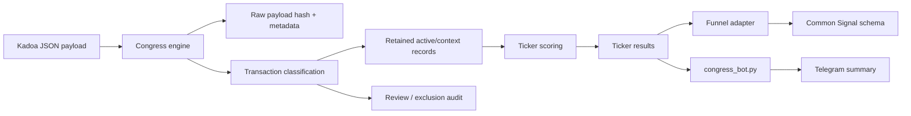

# Congress Scanner Refactor

## File Structure

```text
scanners/congress/engine.py
  Shared Congress scanner engine.
  Owns raw payload preservation, transaction classification, scoring, audit,
  and ledger-aware signal suppression.

funnel/congress_adapter.py
  Converts engine ticker results into common funnel Signal objects.
  Persists a local ledger snapshot and optional audit bundle.

congress_bot.py
  Telegram presentation wrapper over the shared engine.
```

## Data Flow



## Transaction Schema

Each classified transaction now carries:

- `trade_key`, `fingerprint`, `source_trade_id`
- `broad_outcome`: `RETAINED_ACTIVE`, `RETAINED_CONTEXT`, `REQUIRES_REVIEW`, `EXCLUDED`
- `reason`: examples include `ACTIVE_FRESH`, `ACTIVE_LATE_DISCLOSED`, `RECENT_SALE_CONTEXT`, `UNRESOLVED_PUBLIC_SECURITY`, `DUPLICATE`
- `transaction_date`, `filing_date`, `transaction_age`, `filing_age`, `days_to_file`, `late_filing_status`
- `ticker`, `asset_name`, `asset_type`, `transaction_type`, `owner`, `filer_id`, `filer_name`, `branch`, `chamber`, `source`
- `amount_range_low`, `amount_range_mid`, `amount_range_high`
- `option_side`, `strike`, `expiry`
- `is_new_discovery`, `is_materially_amended`, `trigger_type`, `activity_weight`

## Active Event Rules

- Fresh bullish events: purchase or clear call within `45` transaction days
- Late disclosure path: filing age `<= 14`, transaction age `46-120`
- Historical records remain auditable context but do not create current bullish capital
- Known late disclosures stay scoreable for audit, but `alertable=False` once the ledger has already seen them

## Sample Audit Output

```json
{
  "total_raw_records": 5000,
  "duplicate_records": 73,
  "out_of_scope_assets": 1844,
  "invalid_or_unresolved_tickers": 29,
  "unsupported_or_non_discretionary": 91,
  "historical_context_records": 1402,
  "recent_sale_context": 214,
  "active_fresh_transactions": 37,
  "active_late_disclosed_transactions": 6,
  "active_tickers_before_market_checks": 28,
  "tickers_rejected_missing_yahoo_data": 3,
  "tickers_rejected_insufficient_pricing_coverage": 2,
  "scored_tickers": 23
}
```

## Migration Notes

`congress_bot.py` no longer owns transaction parsing or scoring. It is now only a delivery wrapper over the shared engine. Any future rule change should land in `scanners/congress/engine.py` first.

## Residual Risk

The adapter currently persists its ledger to a local JSON file under `funnel_output/congress_state`. That is enough for local runs and deterministic tests, but GitHub Actions workspaces are ephemeral, so production-grade repeat-alert suppression still wants a durable store such as a dedicated Google Sheet table or another persisted state layer.
